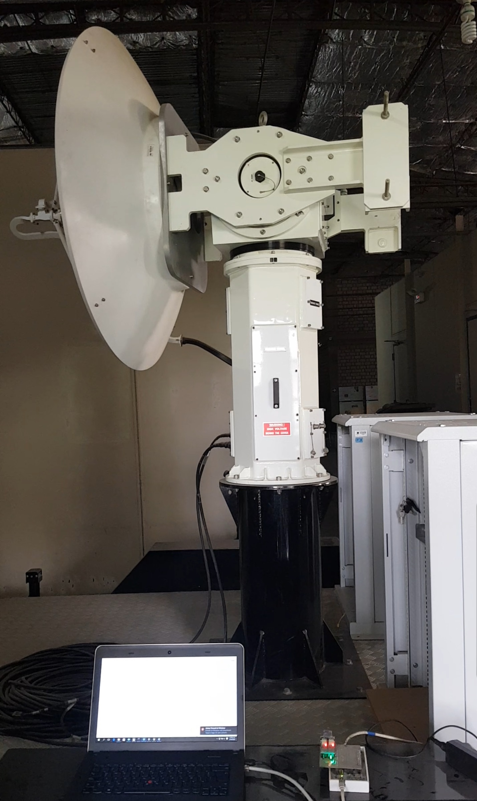

<p align="center">
  <a href="" rel="noopener">
 </a>
</p>

<h3 align="center">Pedestal Controller</h3>

<div align="center">

[]()
[](https://github.com/davidcaceres1512/DSA_pedestal/issues)
[](https://github.com/davidcaceres1512/DSA_pedestal/pulls)
[](/LICENSE)

</div>

---

<p align="center"> Pedestal controller for a weather radar.
    <br> 
</p>

## 📝 Table of Contents

- [About](#about)
- [Getting Started](#getting_started)
- [Deployment](#deployment)
- [Usage](#usage)
- [Built Using](#built_using)
- [TODO](../TODO.md)
- [Contributing](../CONTRIBUTING.md)
- [Authors](#authors)
- [Acknowledgments](#acknowledgement)

## 🧐 About <a name = "about"></a>
---

Write about 1-2 paragraphs describing the purpose of your project.

## 🏁 Getting Started <a name = "getting_started"></a>
---

These instructions will get you a copy of the project up and running on your local machine for development and testing purposes. See [deployment](#deployment) for notes on how to deploy the project on a live system.

### Prerequisites
---

- [Firmware](#req_firmware)
- [Software](#req_software)
- [Hardware](#deployment)
#### Firmware <a name = "req_firmware"></a>

#### - libraries
libraries used in the framework arduino-cli with stm32duino_core 1.9.0.
1. decompress libraries.zip in the folder libraries

> open readme [here](libraries/firmware/readme.md)
#### Software <a name = "req_software"></a>

#### - broker
- **in windows:**
1. Install broker  [mosquitto](https://mosquitto.org/download/) 1.6.x.

2. deactivate firewall or add new rule into firewall (port 1883).


3. activate the service mosquitto.

> **warning!**
> if you install mosquitto 2.x.x you have modified mosquitto.conf
> 1. add the next words into file **mosquitto.conf**
> ```bash
> listener 1883
> allow_anonymous true 
> ```
> 2. restart the services for surting effect the modified  
> ```cmd
> windows+r => services.msc
> restart mosquitto
> ```
> *click [here](http://www.steves-internet-guide.com/install-mosquitto-broker/) for more information.* 

- **in ubuntu:**

1. Install broker  [mosquitto](https://mosquitto.org/download/) 1.6.x.
```bash
sudo apt-add-repository ppa:mosquitto-dev/mosquitto-ppa
sudo apt-get update
sudo apt-get install mosquitto
```
2. Add new rule into firewall (port 1883).
```bash
sudo ufw allow 1883 
sudo ufw enable
```
3. Verify is not already running
```bash
pgrep mosquitto
```
> **Note** 
> if any number shows, that is the PID of an already running Mosquitto. You can just kill it. Also, you can try: 
> ```bash
> sudo service mosquitto stop
> ```  

4. Start Mosquitto with verbose option
```bash
mosquitto -v
```

> **warning!**
> if you install mosquitto 2.x.x you have modified mosquitto.conf
> 1. add the next words into file **mosquitto.conf**
> ```bash
> sudo nano mosquitto.conf
> listener 1883
> allow_anonymous true 
> ```
> 2. restart the services for surting effect the modified  
> ```bash
> pgrep mosquitto | xargs kill
> sudo service mosquitto start
> ```
> *click [here](https://askubuntu.com/questions/1121524/mosquito-server-refuses-connections-ubuntu-18-04) for more information.* 

#### - python 3.9  

1. install python 3.9
```bash
#!/bin/sh

# install PPA
sudo add-apt-repository ppa:deadsnakes/ppa

# update and install
sudo apt update
sudo apt install python3.9 python3.9-dev python3.9-venv

# setup alternatives
sudo update-alternatives --install /usr/bin/python3 python3 /usr/bin/python3.6 1
sudo update-alternatives --install /usr/bin/python3 python3 /usr/bin/python3.9 2

# show menu for selecting the version
sudo update-alternatives --config python3
```

2. install pip in python 3.9

```bash
#install pip for specific version
curl https://bootstrap.pypa.io/get-pip.py | sudo python3.9
```
> *optional*
> ```bash
> # you can separate pip with "update-alternatives"
> sudo update-alternatives --install /usr/bin/pip pip /usr/bin/pip3 1
> # show menu for selecting the version
> sudo update-alternatives --config pip 
> ```

#### - python requirements  


1. install the requirements

```python
pip install -r libraries/software/requirements.txt
```

#### - hdf5 viewer

1. install panoply or hdf5group

> click [here](https://www.giss.nasa.gov/tools/panoply/) to install panoply

2. verified java
```bash
java --version
```
2. install java
```bash
sudo apt install default-jdk
```
3. execute Panoply.jar 
```bash
java -jar jars/Panoply.jar
```

#### - docker

> click [here](https://docs.docker.com/engine/install/ubuntu/) to install docker in ubuntu 18.04

### Installing

A step by step series of examples that tell you how to get a development env running.

Say what the step will be

```
Give the example
```

And repeat

```
until finished
```

End with an example of getting some data out of the system or using it for a little demo.

## 🔧 Running the tests <a name = "tests"></a>

Explain how to run the automated tests for this system.

### Break down into end to end tests

Explain what these tests test and why

```
Give an example
```

### And coding style tests

Explain what these tests test and why

```
Give an example
```

## 🎈 Usage <a name="usage"></a>

Add notes about how to use the system.

## 🚀 Deployment <a name = "deployment"></a>

Add additional notes about how to deploy this on a live system.
